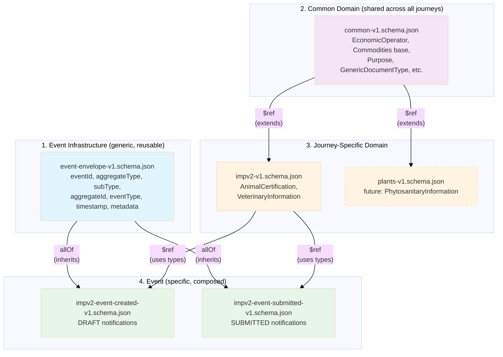

# Trade Imports Schemas

## EUDP Event Schemas

JSON Schema definitions for EUDP notification events

## Schema Arrangement

The schemas are structured for reusability across import journeys:

### Common Domain

`common-v1.schema.json`
- Shared business domain types across all import journeys (animals, plants, poao)
- Journey-agnostic types: EconomicOperator, Commodities, Purpose, ApprovedEstablishment, etc.
- Shared and discriminated types such as Documents
- Agnostic to events

### Event Specification

`event-envelope-v1.schema.json`
- Generic event envelope designed to frame events emitted by all user journeys
- Reusable across all aggregate types
- Contains:
  - eventId
  - aggregateType
  - subType
  - aggregateId
  - aggregateVersion
  - eventType
  - timestamp
  - metadata

### Journey-Specific Domain Description

`impv2-v1.schema.json`
- Extends common domain with live animals (IMPv2) specific types
- Animal-specific types: AnimalCertification, VeterinaryInformation
- Restricts AccompanyingDocument to allow only generic and animal document types
- Extends Commodities with AnimalCertification for animalsCertifiedAs field
- Compatible with DEFRA/ipaffs-imports-notification-schema


### Journey Specific Events

`impv2-event-created-v1.schema.json`
- Composes envelope + journey-specific domain model
- Published when a notification draft is created
- Minimal required fields: referenceNumber, type, status (DRAFT), commodities (with at least one commodity and countryOfOrigin)

`impv2-event-submitted-v1.schema.json`
- Composes envelope + journey-specific domain model
- Published when a notification is submitted for processing
- All mandatory business fields are required (13 fields including veterinaryInformation)

## Schema Arrangement




### Journey-Specific Document Type Restriction

Common  (`common-v1.schema.json`):
```json
{
  "AccompanyingDocumentsCommon": {
    "type": "object",
    "properties": {
      "documentType": { "type": "string" },
      "documentReference": { "type": "string" },
      "documentIssueDate": { "type": "string", "format": "date" }
    }
  },
  "GenericDocumentType": {
    "enum": ["airWaybill", "billOfLading", "commercialInvoice", ...]
  },
  "AnimalDocumentType": {
    "enum": ["veterinaryHealthCertificate", "itahc", ...]
  },
  "PlantDocumentType": {
    "enum": ["phytosanitaryCertificate", "heatTreatmentCertificate", ...]
  }
}
```

Journey-Specific (`impv2-v1.schema.json`):
```json
{
  "AccompanyingDocument": {
    "allOf": [
      { "$ref": "common-v1.schema.json#/$defs/AccompanyingDocumentsCommon" },
      {
        "properties": {
          "documentType": {
            "anyOf": [
              { "$ref": "common-v1.schema.json#/$defs/GenericDocumentType" },
              { "$ref": "common-v1.schema.json#/$defs/AnimalDocumentType" }
            ]
          }
        }
      }
    ]
  }
}
```

## Validation

### Schema Validation

Run the validation suite to verify schema correctness:

```bash
npm run validate-schemas
```

### Sample Event Validation

Validate sample event JSON files in `/samples` directory:

```bash
npm run validate-samples
```