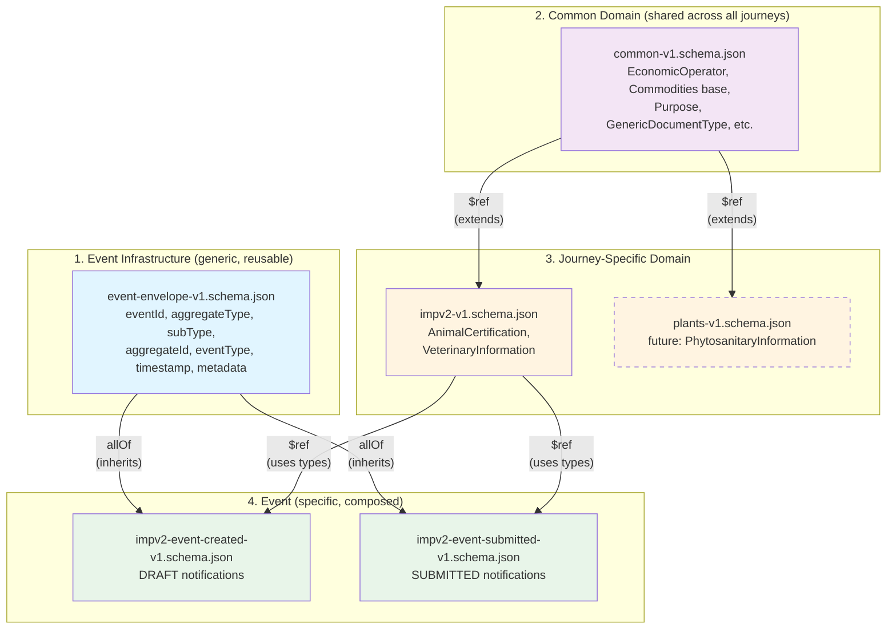

# Trade Imports Schemas

## EUDP Event Schemas

JSON Schema definitions for EUDP notification events

## Schema Arrangement

The schemas are structured for reusability and progressive specificity:

### Common Domain

`common-v1.schema.json`
- Shared business domain types across all import journeys (animals, plants, POAO)
- Journey-agnostic types: EconomicOperator, Commodities, Purpose, ApprovedEstablishment, etc.
- Shared and discriminated types such as Documents
- Agnostic to journey specific events (this is still an event and not a domain schema)

### Event Specification

`event-envelope-v1.schema.json`
- Generic event envelope designed to frame events emitted by all user journeys
- Reusable across all aggregate types
- Contains:
  - eventId
  - aggregateType
  - subType
  - aggregateId
  - aggregateVersion
  - eventType
  - timestamp
  - metadata

### Journey-Specific Domain Description

`impv2-v1.schema.json`
- Extends common domain with live animals (IMPv2) specific types
- Animal-specific types: AnimalCertification, VeterinaryInformation
- Restricts AccompanyingDocument to allow only generic and animal document types
- Extends Commodities with AnimalCertification for animalsCertifiedAs field
- Compatible with DEFRA/ipaffs-imports-notification-schema


### Journey Specific Events

`impv2-event-created-v1.schema.json`
- Composes envelope + journey-specific domain model
- Published when a notification draft is created
- Minimal required fields: referenceNumber, type, status (DRAFT), commodities (with at least one commodity and countryOfOrigin)

`impv2-event-submitted-v1.schema.json`
- Composes envelope + journey-specific domain model
- Published when a notification is submitted for processing
- All mandatory business fields are required (13 fields including veterinaryInformation)

## Schema Arrangement




### Journey-Specific Document Type Restriction

The journey schemas use inline restriction at point-of-use to provide schema-enforced type safety without requiring the common schema to pre-categorize document types by journey.

**Common Layer** (`common-v1.schema.json`):
```json
{
  "DocumentType": {
    "type": "string",
    "description": "Complete superset of all document types across all journeys",
    "enum": [
      "airWaybill",
      "billOfLading",
      "veterinaryHealthCertificate",
      "phytosanitaryCertificate",
      "..."
    ]
  },
  "AccompanyingDocument": {
    "type": "object",
    "properties": {
      "documentType": { "$ref": "#/$defs/DocumentType" },
      "documentReference": { "type": "string" },
      "documentIssueDate": { "type": "string", "format": "date" }
    }
  }
}
```

**Journey Layer** (`impv2-v1.schema.json`):
```json
{
  "VeterinaryInformation": {
    "properties": {
      "accompanyingDocuments": {
        "description": "Restricts to animal-relevant document types only",
        "items": {
          "allOf": [
            { "$ref": "common-v1.schema.json#/$defs/AccompanyingDocument" },
            {
              "properties": {
                "documentType": {
                  "description": "Journey-specific subset valid for animal imports",
                  "enum": [
                    "airWaybill",
                    "billOfLading",
                    "veterinaryHealthCertificate",
                    "itahc",
                    "journeyLog"
                  ]
                }
              }
            }
          ]
        }
      }
    }
  }
}
```

**Key benefits:**
- Common layer doesn't need to know which types belong to which journey
- Each journey independently declares valid documents for its context
- Schema-enforced type safety (phytosanitary certs rejected for animals)
- Easy to add new document types (add to common, journeys opt-in)

## Versioning Strategy

This repository uses two versioning concepts:

### Git Release Versions (Semantic Versioning)

Git tags (`v1.0.0`, `v1.1.0`, `v2.0.0`) represent snapshots of the entire repository:
- **MAJOR** (v2.0.0): Breaking change to any schema (removed fields, changed semantics)
- **MINOR** (v1.1.0): New schemas, backward-compatible additions (new event types, expanded enums)
- **PATCH** (v1.0.1): Documentation updates, tooling fixes, no schema changes

### Schema File Versions

Filenames include version suffix (`common-v1.schema.json`, `impv2-v1.schema.json`) that changes only on breaking changes to that specific schema.

**Examples:**
- Release **v1.0.0** contains: `common-v1`, `impv2-v1`
- Release **v1.1.0** contains: `common-v1` (expanded enum), `impv2-v1` (new event type added)
- Release **v2.0.0** contains: `common-v1`, `common-v2`, `impv2-v1`, `impv2-v2` (all versions coexist)

Create a new schema file version when making breaking changes:
- Removing required fields
- Making optional fields required
- Changing field semantics (e.g., `amount` changes from pence to pounds)
- Removing enum values

Update existing schema file in place when:
- Adding optional fields
- Expanding enum values (with defensive consumer handling)
- Adding new event types (different schema files)
- Clarifying descriptions

**Changelog:** All changes documented in [CHANGELOG.md](./CHANGELOG.md) following [Keep a Changelog](https://keepachangelog.com/) format.

## Validation

### Schema Validation

Run the validation suite to verify schema correctness:

```bash
npm run validate-schemas
```

### Sample Event Validation

Validate sample event JSON files in `/samples` directory:

```bash
npm run validate-samples
```