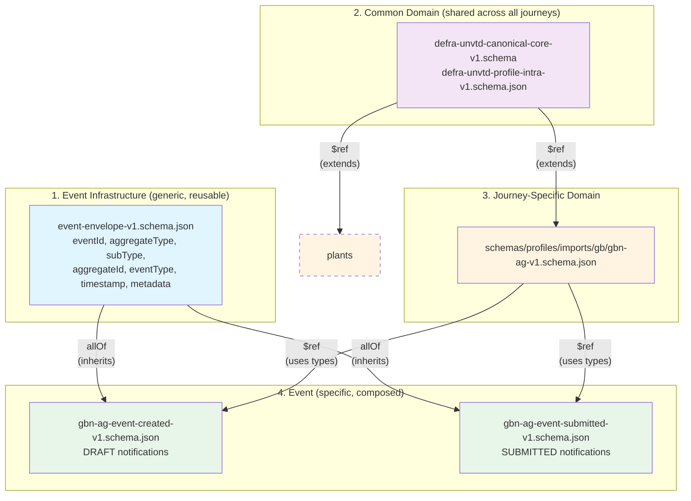

# Problem Statement

Sanitary and Phytosanitary (SPS) controls are the measures governments use to protect human, animal, and plant health when goods move across borders. They apply to live animals, animal products, plants, and plant products. The official SPS Certificate schema, part of the larger Buy-Ship-Pay (BSP) model, describes an export-oriented model for the movement of these goods.

Defra requires that some categories of goods be raised in UK national systems as Import Notifications to support UK-specific operational and regulatory needs.

The BSP / SPS model does not provide a UK Import model for live animals. It does provide common concepts and means of extension that allow such a journey to be described.

The goal is to maximise interoperability within the Defra ecosystem by using a common model to describe UK Import Notifications.

# Context

While a member of the EU, the UK operated within a shared SPS framework governed by the Official Controls Regulation (EU 2017/625, the OCR). The OCR mandates the use of TRACES as the system of record for import notifications, border controls, and certification. UK SPS processes, systems, and enforcement practices were built around this framework.

When the UK left the EU single market on 31 December 2020, it needed to stand up its own SPS controls regime. Rest of World (RoW) imports applied full controls immediately. EU imports were delayed repeatedly over three years.

The Border Target Operating Model (BTOM), published in August 2023, set out a phased introduction of SPS controls on EU imports. Since Brexit and the adoption of the BTOM, the UK has required importers to raise notifications as Common Health Entry Documents (CHEDs) using IPAFFS (Import of Products, Animals, Food and Feed System).

The May 2025 UK-EU Common Understanding committed to removing certificates and controls for the vast majority of EU movements. This is the policy change that triggered EU Reset.

EU Reset will deliver a new set of SPS controls for EU imports and replatform the existing CHED journeys. In the process, the data definitions will be restructured to align with UN/CEFACT.

# UN/CEFACT SPS Certificate

The UN/CEFACT Sanitary and Phytosanitary (SPS) Certificate is an international standard for exchanging electronic health certificates for animals, plants, and products. It is based on the Buy-Ship-Pay (BSP) model and enables government authorities to exchange data securely. 

## GBN-AG Design Philosophy and Alignment with UNCEFACT

Defra interoperability with Traces is via the Defra Traces Integration Gateway (TIG). TIG offers a modern JSON HTTP API (and an anti-corruption layer) to internal services such those supporting GBN-AG. **IMPORTANT**: within the Canonical Core Schema many XML element names have been changed (shortened), and aligned with D23B. Core also changes the _structure_ of XML model but retains the correct semantics via JSON-LD. This can be confusing at first. To retain interoperability with Core and Traces the GBN-AF guiding design principal is to replicated the structures and patterns in this order of precedence:

- Defra Canonial Core Model
- [Traces NT XML (eCert Master) Model](https://unece.org/trade/uncefact/xml-schemas)
- [Buy Ship Pay (BSP) D23B SPS Model](https://vocabulary.uncefact.org/home)

Where new concepts are required, such as `permanentLocation` ot `cphNumber`, their semantics are defined in JSON LD and their structure is captured in the gbn-ag schema.

### Links
- [Supply Chain REFERENCE DATA MODEL (SCRDM)](https://service.unece.org/trade/uncefact/publication/SupplyChainMGMT/SCRDM/HTML/001.htm)
- [https://github.com/uncefact](https://vocabulary.uncefact.org/home) ([schema](https://github.com/uncefact/spec-JSONschema/blob/main/JSONschema2020-12/meta-library/BuyShipPay/D23B/UNECE-SPSCertificate.json))
- [EU Intra Rules](https://webgate.ec.europa.eu/imsoc-guide/tracesnt-help/Content/en/documents-certificates/eu-intra/part-i.html)

# Data Structures

## IPAFFS and the Notification Schema

The CHED import control process follows three parts: Notification, Decision, and Follow-up (EU Regulation 2019/1715 - Article 40). Both EU and RoW imports follow the same three parts and use the same systems (the Notification Portal for Part 1, a case management system for Parts 2 and 3). The difference is in what happens at each part (depth of checks, where the decision is made, whether follow-up is triggered), not the systems or whether the part exists.

The data captured for each CHED type (CHED-A, CHED-D, CHED-P, CHED-PP) via the IPAFFS User Journeys is defined by the [IPAFFS Notification Schema](https://github.com/DEFRA/ipaffs-imports-notification-schema/tree/master/notification-schema-core/resources).

## EU Live Animals

Each journey follows an architecturally similar pattern. It raises events using a transactional outbox pattern onto a journey-specific SNS Topic; interested consumers subscribe via SQS queues.

**Transactional outbox pattern:**
- Journey service writes the Import Notification and the "outbox event" in a single transaction.
- An embedded background worker (within the same service container) polls the outbox collection and publishes to SNS.
- FIFO ordering guaranteed by (1) MongoDB distributed locking in the outbox worker, (2) SQS FIFO queues with `MessageGroupId` for gateway/adapter processing.
- Remediation / failure recovery:
  - SQS ensures failed messages automatically reappear for retry.
  - A DLQ captures messages that fail repeatedly, enables manual investigation, and supports redrive for replay.
  - Worker processes continuously retry unsent events from the outbox collection.

Events emitted by the journey services share a common envelope. The data section of each event is a JSON object that conforms to a schema based on the UN/CEFACT SPS Certificate.

# Lessons from IPAFFS Schema Analysis

## Conflating Concerns

The current IPAFFS schema serves every CHED type (CHED-A, CHED-D, CHED-P, CHED-PP) from a single notification model. That model holds the regulatory data, but it also holds fields that track where the user is in the form-filling journey, internal risk-assessment outputs, billing fields, workflow flags, and deprecated fields that no current journey populates.

The new schema family is journey-specific - GB Notification for Animals and Germinals (GBN-AG) for live animals; future schemas for plants and plant products will be GBN-P and GBN-PP. Workflow and internal state live in a journey collection in MongoDB. The schema and the events it shapes carry only the regulatory payload.

## Mapping IPAFFS to UN/CEFACT

Three patterns recur in the JSON.

**Identifiers / UN/CEFACT codelists.** When the schema records a County Parish Holding (CPH) number, a Border Control Post (BCP) reference, a port's UN/LOCODE, or a transporter's approval number, it also records which list that identifier was drawn from and who maintains the list. The value travels with its provenance. A reader does not have to guess what `CPH19876` is - the metadata next to it says "this is from the CPH register, maintained by Defra".

**Carrier / UN/CEFACT typeCodes.** The carrier in our example is both a "commercial transporter" under one operator-activity scheme and a "transporter" under a separate operator-classification scheme. The schema carries both classifications at once, tagging each with the scheme it comes from. A consumer reading the party can filter for whichever scheme it cares about.

**Reasons and certifications / UN/CEFACT documentClause.** The reason for import ("internal market", "transit", "re-entry") is a formal statement where the value comes from a controlled list. So is the animal certification category ("breeding and production", "slaughter", "approved bodies"). The schema records each statement as two parts: what is being declared (the reason for import; the animal certification category) and the value being given for that declaration ("internal market"; "breeding and production").

The UN/CEFACT model is layered. The full Buy-Ship-Pay (BSP) library defines a vocabulary for moving goods across borders. The SPS Certificate is a narrower profile of that vocabulary; it leaves out slots it does not need for plant-and-animal health certificates. Some of what the SPS profile leaves out matters to UK imports: the importer party, the permanent destination location, the cross-border regulatory procedure declaration, and the document clauses. Where this happens, we go back to the full BSP library and put the slot back into our schema.

Not every concept maps cleanly. The IPAFFS `purpose` data, for example, ends up split across three different UN/CEFACT slots depending on whether the sub-field describes the reason for import, the transit countries, or the regulatory procedure. Some IPAFFS concepts have no UN/CEFACT slot at all. The unweaned-animals indicator (does this consignment contain unweaned animals?) is a UK welfare question with no UN/CEFACT equivalent, so we add a Defra-specific field on the consignment.

## Reference Data

The schema is not bound to lists of valid values. Properties that carry codelist values are typed as plain strings; their metadata names which list the value should be drawn from. The list itself lives in Master Data Management (MDM), Defra's reference-data system. The source system filling in a notification validates against MDM at submission time.

The schema does not embed reference-data lists. The reason is operational: reference data evolves on its own cadence (a new CPH number issued today, a transporter approval revoked tomorrow), and the schema's release cycle should not be coupled to it.

Where EU TRACES lists cover the concept, we adopt them rather than inventing parallel Defra lists. The `ched_consignment_clause` list, owned by European Commission DG SANTE, supplies the values for purpose and animal certification category. The `operator_activity_type` and `classification_section_code` lists supply party classifications. Adopting EU or ISO lists where they exist keeps the import side compatible with TRACES production data and avoids a translation layer at the boundary.

## UK-Specific Concepts

UK regulatory needs introduce concepts no EU list covers:

- **County Parish Holding (CPH) numbers** identify UK animal premises; every farm or holding has one. Needed for livestock tracking.
- **Border Control Post (BCP) references** identify the specific inspection point at the border that handles each consignment.
- **Private transporter approval numbers** identify hauliers approved under the UK welfare-in-transport regime.

All three are Defra-curated lists; none exists in the EU's published codelists. In the schema we model each as a UN/CEFACT `idType` carrying a Defra `schemeId` tag, placed on the semantically relevant slot:

- CPH on the consignment's final destination location.
- BCP on the cross-border regulatory procedure's entry customs office.
- Transporter approval on the carrier party.

## TRACES Integration Gateway Modelling

The TRACES Integration Gateway (TIG) team are building similar models. Three divergences are worth flagging:

- Coded statements (the reason for import, the animal certification category) live on one part of the document in our schema and on a different part of the document in TRACES production data. Same data, different home.
- Per-animal identifiers (ear tags, passports) can sit either on each individual animal (BSP-canonical placement, on `individualTradeProductInstance[]`) or as notes against the consignment line item tagged by note type (operational TRACES placement). The GBN-AG worked example currently carries both placements with the same data so the joint review with TIG can settle on a single canonical placement.
- We treat the importer as a distinct party with its own slot; TRACES production data often merges the importer into the consignee.



## Live-animals structural rules

Three product-owner rules shape the GBN-AG schema beyond raw vocabulary alignment.

### Multiple commodity lines per consignment

One ITAHC (and one GBN-AG payload) can carry more than one commodity line. Cats and ferrets can travel under a single ITAHC; cows and cats cannot. Which commodities can share an ITAHC is a policy question, not a schema question - the schema permits multiple `includedTradeLineItem[]` entries (`minItems: 1`, no `maxItems` cap) and leaves the producer to enforce compatibility.

### CPH at consignment level

The County Parish Holding (CPH) number sits at consignment level (on `finalDestinationLocation.identifier`), not per trade line. This follows from the previous rule: animals that require a CPH (livestock) cannot be on the same ITAHC as animals that do not (horses, cats, ferrets), so a consignment that requires a CPH only ever needs one.

### Place of destination at consignment, Permanent Address per animal

The Place of destination is the physical delivery point of the consignment (always mandatory; modelled as `deliveryParty`). The Permanent Address is where each individual animal will live long-term (per-animal; modelled as `tradeProductInstance.permanentLocation`, conditional on commodity).

For livestock the two are usually the same: the consignment is delivered to the CPH-tagged farm, every animal stays there. For pets they are distinct: the consignment delivers to one business address (e.g. an importer's premises) and each animal then goes on to its own permanent home.

## Describing the goods

A GBN-AG certificate covers one consignment, and its goods are declared as trade lines - one line per species or commodity - under
`specifiedConsignment.includedConsignmentItem[].includedTradeLineItem[]`. A mixed load (cattle plus sheep, or live animals plus germinals) is several lines. Each line carries its own codes, quantity, packaging, and animal records, with no blended consignment-level total.

Each line holds:

```
  specifiedConsignment
  └── includedConsignmentItem[]                    [1..1]  exactly one item per certificate
      └── includedTradeLineItem[]                  [1..*]  ONE LINE PER SPECIES / COMMODITY
          ├── applicableClassification[]           [1..*]  commodity code (CN), species class
          ├── description[]                         string  free-text commodity description
          ├── scientificName / commonName                  species identity (from refdata)
          ├── typeCode + urlId                             form: LIVE_ANIMAL | SEMEN | EMBRYO | OVA
          │
          ├── specifiedLineTradeDelivery[]         [1..*]  the declared QUANTITY (one in practice)
          │   └── productUnitQuantity
          │       ├── content            number           the value: how many, or how much
          │       └── unitCode           string           H87 = head count | KGM = kilograms
          │
          ├── physicalReferencedLogisticsPackage[] [0..*]  the PACKAGES (optional; per line)
          │   ├── itemQuantity           integer          number of packages
          │   ├── typeCode               string           UNECE package type (cage, crate, ...)
          │   └── levelCode              integer          UNECE packaging-hierarchy level
          │
          ├── netWeight                                    physical weight (distinct from quantity)
          ├── individualTradeProductInstance[]     [0..*]  per-animal records (IDs, permanent home)
          └── additionalInformationNote[]          [0..*]  per-line notes
```

**Commodity codes.** Classification sits on the line at `applicableClassification[]`. Each entry pairs a `systemId` with a `classCode` (the value): `"CN"` carries the customs nomenclature code at `classCode.value`, with the codelist URL on `classCode.urlId`. A line may carry more than one entry when more than one system applies. 

**Species identity.** `scientificName` and `commonName` name the species, resolved from Defra reference data keyed on the `CN` code rather than trader-entered. `description[]` is the free-text commodity description.

**Form.** `typeCode`, with `urlId` naming its codelist, records the form - `LIVE_ANIMAL`, `SEMEN`, `EMBRYO`, or `OVA`. Form is held separately because the handling regime and the quantity unit differ by form even where the `CN` code does not discriminate it.

**Quantity and unit.** The declared quantity is one slot, `specifiedLineTradeDelivery[].productUnitQuantity`: a number in `content` with a sibling `unitCode` that says how to read it e.g `H87` for a head count (live animals), `KGM` for a kilogram weight (commodities measured by mass, such as embryos, ova, or semen). The value is the declared quantity only, kept distinct from the line's physical `netWeight`. The array permits more than one entry (`minItems: 1`, no `maxItems`), but the model uses exactly one per line.

> **Design decision - not the TRACES shape.** TRACES eCert has no line-quantity slot,
> so it overloads measure fields: the count on `NetVolumeMeasure(H87)`, a weighed
> amount on `NetWeightMeasure(KGM)`. GBN-AG keeps `productUnitQuantity` instead,
> because one slot spans counts and weights and reads as a quantity rather than a
> volume. The eCert form stays recoverable if a round-trip to SPS XML is needed:
> `H87` maps to `NetVolumeMeasure`, `KGM` to `NetWeightMeasure`.

**Packaging.** `physicalReferencedLogisticsPackage[]` carries the packages per line: `itemQuantity` (the count), `typeCode` (the package type, an open value from the UNECE PackageTypeCode list), and `levelCode` (the packaging-hierarchy level). Optional - loose-loaded goods, such as livestock in a single trailer compartment, omit it.

> **Follows the TRACES shape.** eCert carries packages on the line rather than the
> consignment; GBN-AG matches that, so a mixed consignment carries a package group on
> each line and no consignment-level aggregate.

**Per-animal records and notes.** `individualTradeProductInstance[]` holds one entry per individual animal - its regulatory identifiers and the `permanentLocation` for where it will live after import. It is optional and empty for germinals. `additionalInformationNote[]` carries per-line notes.
