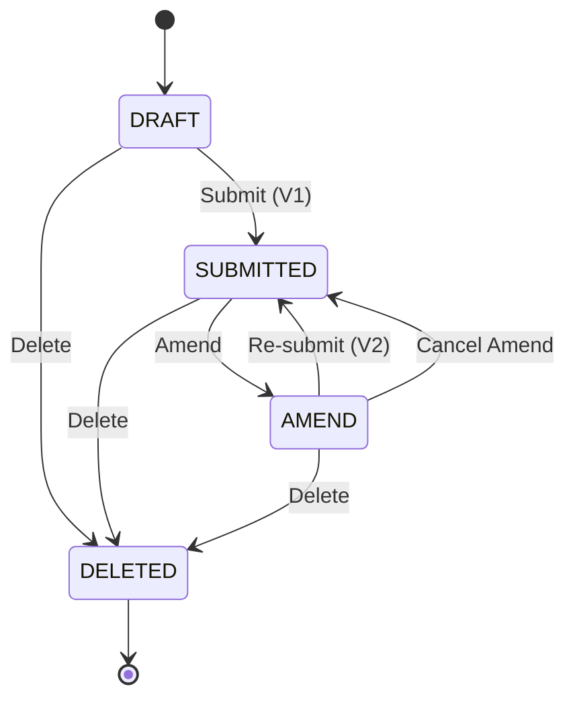

# GBN-AG state transitions

States a GBN-AG notification moves through from creation to termination.

## States

- **DRAFT** - created, not yet submitted; editable by the importer.
- **SUBMITTED** - formally submitted. First submission is revision V1.
- **AMEND** - re-opened for editing after a prior submission.
- **DELETED** - terminal.

## Where information lives

Three concepts get conflated unless laid out explicitly. Each lives in a different place.

| Concept | What it is | Where it lives |
|---|---|---|
| Event identity | This specific event occurrence (deduplication, audit, replay tooling). | `eventId` in the event envelope. |
| Aggregate sequence | The Nth event emitted for this notification. Monotonic per aggregate. Used for ordering, idempotency, optimistic concurrency. | `aggregateVersion` in the event envelope. |
| Document state | The notification's business state: workflow status (`DRAFT` / `SUBMITTED` / `AMEND` / `DELETED`) and revision number (`V1`, `V2`, ...). | `notificationStatusCode` and `versionId` on `ExchangedDocument` in the event's `data` payload. |

`documentStatusCode` (UNCL1373 per UN/CEFACT) is the TRACES-boundary status value. The gateway populates it on outbound TRACES messages and round-trips it on inbound. Not used for Defra-internal workflow state.

The UN/CEFACT message function (`functionCode`, UNTDID 1225) is not carried on these events. It stays defined in the canonical core for a boundary that emits a UN/CEFACT message, derived there from the notification's status and `versionId`: Original on the first submission, Replace on later revisions, Cancellation once DELETED. Internal consumers order by `aggregateVersion` and read state from `notificationStatusCode`.

Wall-clock `timestamp` is for audit only; don't use it for ordering. Use `aggregateVersion` for that.

## Transitions

| From | To | Trigger | Event | `versionId` |
|---|---|---|---|---|
| (entry) | DRAFT | create | `NotificationCreated` | (none) |
| DRAFT | SUBMITTED | Submit | `NotificationSubmitted` | `1` |
| SUBMITTED | AMEND | Amend | `NotificationAmendmentRequested` | unchanged |
| AMEND | SUBMITTED | Re-submit | `NotificationSubmissionAmended` | `2`, `3`, ... |
| AMEND | SUBMITTED | Cancel Amend | `NotificationAmendmentCancelled` | unchanged |
| DRAFT | DELETED | Delete | `NotificationDeleted` | (none) |
| SUBMITTED | DELETED | Delete | `NotificationSubmissionDeleted` | unchanged |
| AMEND | DELETED | Delete | `NotificationSubmissionDeleted` | unchanged |

## Revision numbering

V1 / V2 refer to the notification revision (Submit, then Re-submit), not the schema version. A notification that goes Submit → Amend → Re-submit → Amend → Re-submit carries revisions V1, V2, V3. Cancel Amend abandons an in-progress amendment without minting a revision: the notification returns to its last submitted revision unchanged.