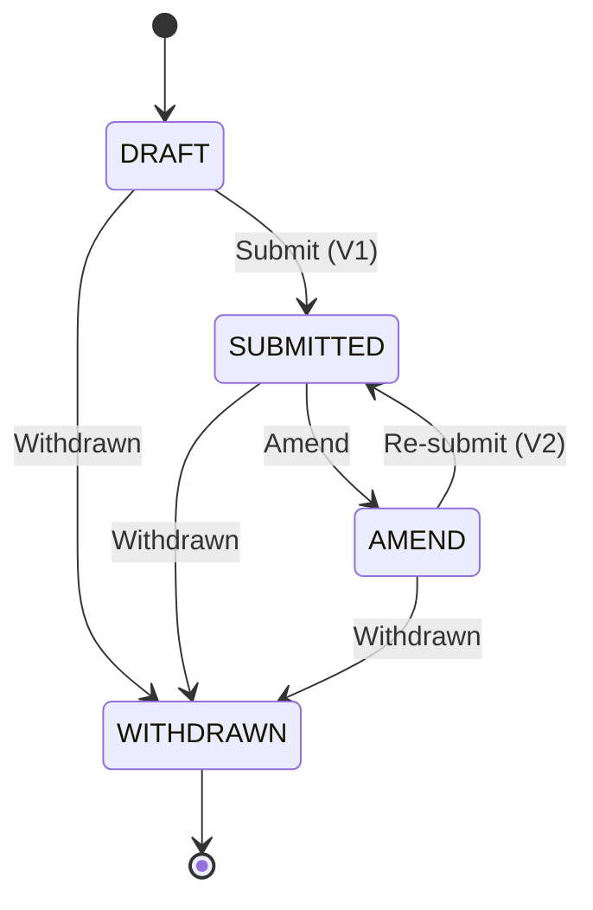

# GBN-AG state transitions

States a GBN-AG notification moves through from creation to termination.

## States

- **DRAFT** - created, not yet submitted; editable by the importer.
- **SUBMITTED** - formally submitted. First submission is revision V1.
- **AMEND** - re-opened for editing after a prior submission.
- **WITHDRAWN** - terminal.

## Where information lives

Three concepts get conflated unless laid out explicitly. Each lives in a different place.

| Concept | What it is | Where it lives |
|---|---|---|
| Event identity | This specific event occurrence (deduplication, audit, replay tooling). | `eventId` in the event envelope. |
| Aggregate sequence | The Nth event emitted for this notification. Monotonic per aggregate. Used for ordering, idempotency, optimistic concurrency. | `aggregateVersion` in the event envelope. |
| Document state | The notification's business state: workflow status (`DRAFT` / `SUBMITTED` / `AMEND` / `WITHDRAWN`), revision number (`V1`, `V2`, ...), and the message function (`Original` / `Replace` / `Cancellation`) that tells the consumer what to do with this snapshot. | `documentStatusCode`, `versionId`, `functionCode` on `ExchangedDocument` in the event's `data` payload. |

Wall-clock `timestamp` is for audit only; don't use it for ordering. Use `aggregateVersion` for that.

## Transitions

| From | To | Trigger | Event | `versionId` | `functionCode` (UNTDID 1225) |
|---|---|---|---|---|---|
| (entry) | DRAFT | create | `NotificationCreated` | (none) | `9` Original |
| DRAFT | SUBMITTED | Submit | `NotificationSubmitted` | `1` | `9` Original |
| SUBMITTED | AMEND | Amend | `NotificationAmendmentRequested` | `1` (unchanged) | `9` Original (unchanged) |
| AMEND | SUBMITTED | Re-submit | `NotificationSubmissionAmended` | `2`, `3`, ... | `5` Replace |
| DRAFT | WITHDRAWN | Withdrawn | `NotificationWithdrawn` | (none) | `1` Cancellation |
| SUBMITTED | WITHDRAWN | Withdrawn | `NotificationSubmissionWithdrawn` | unchanged | `1` Cancellation |
| AMEND | WITHDRAWN | Withdrawn | `NotificationSubmissionWithdrawn` | unchanged | `1` Cancellation |

## Revision numbering

V1 / V2 refer to the notification revision (Submit, then Re-submit), not the schema version. A notification that goes Submit → Amend → Re-submit → Amend → Re-submit carries revisions V1, V2, V3.
